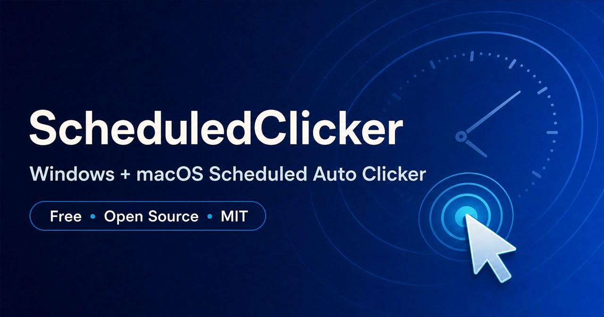

# ScheduledClicker — Windows 11 & macOS Scheduled Auto Clicker

[](https://github.com/HaNa-486/ScheduledClicker/releases/latest)
[](LICENSE)
[](https://github.com/HaNa-486/ScheduledClicker/releases/latest)
[](https://github.com/HaNa-486/ScheduledClicker/releases/latest)



**Website:** [hana-486.github.io/ScheduledClicker](https://hana-486.github.io/ScheduledClicker/)

ScheduledClicker is a free, open-source Windows 11 and macOS utility that performs one single or double mouse click at a specific future time or after a delay. Both native editions are local-only, with no ads, accounts, telemetry, network access, or third-party packages.

It was created for workflows such as sending a prepared Codex message after the usage reset time shown in the app. ScheduledClicker does **not** detect, bypass, reset, or increase any ChatGPT or Codex limit—it only performs an ordinary mouse click at the time you choose.

## Key features

- Schedule one click at an exact future date and time.
- Schedule one click after a seconds, minutes, or hours delay.
- Choose single click or double click at a captured screen coordinate.
- View a live clock, countdown, confirmation, completion, and error states.
- Cancel on screen or use `F8` when the global hotkey is available.
- Run as a portable Windows executable or native universal macOS app with no installer.
- Review the complete C# source, security notes, tests, and SHA-256 report.

## Download

Download the latest Windows executable or universal macOS application from [GitHub Releases](https://github.com/HaNa-486/ScheduledClicker/releases/latest).

- **Windows 11:** download `ScheduledClicker.exe`. It is not commercially code-signed, so Windows SmartScreen may show a warning.
- **macOS 13 Ventura or later:** download `ScheduledClicker-macOS-universal.zip`. It supports both Apple silicon and Intel Macs. The app is ad-hoc signed but not Apple-notarized, so first launch may require Control-clicking the app, choosing **Open**, and confirming in **System Settings → Privacy & Security**.

Compare downloaded files with the SHA-256 values in [`VERIFICATION.md`](VERIFICATION.md), or build directly from the published source.

## Frequently asked questions

### What is ScheduledClicker?

ScheduledClicker is a free Windows 11 and macOS scheduled auto clicker for one timed single or double mouse click at a captured screen position.

### Does the Windows EXE work on a MacBook?

No. The EXE uses Windows WinForms and `user32.dll`, which macOS cannot run natively. Download the separate universal macOS app instead; it uses Apple's AppKit, Quartz, and Accessibility permission model.

### Can it continue a Codex session after usage resets?

Yes. Prepare the message in the same Codex session, keep the window in place, and schedule the click shortly after the reset time displayed by Codex. It does not detect or bypass limits.

### Is ScheduledClicker safe?

The app has no network, telemetry, account, or persistence features and uses no third-party packages. Fixed-coordinate automation can still misclick if a window moves, so test a harmless target first and avoid irreversible actions.

### Is it free and open source?

Yes. The source and executable are published under the permissive MIT License.

---

## 定時滑鼠點擊器

給 Windows 11 與 macOS 使用的免安裝小工具，可在指定時間或一段延遲後，把滑鼠移到預先擷取的位置並執行單擊或雙擊。畫面會持續顯示目前時間與排程倒數。Windows EXE 只能在 Windows 執行；MacBook 請使用獨立的 macOS `.app` 版本。

## 為什麼做這個工具

這個小工具最初是為 ChatGPT Plus 的 Codex 使用情境而設計：當 Codex 顯示目前用量視窗已達上限，並告知可再次使用的時間時，開發者可以事先把「繼續上次中斷的工作」等提示留在原本的 Codex Session，接著設定本工具在重設時間稍後按下送出或繼續按鈕。如此一來，即使開發者正在睡覺，電腦也能在可用額度合法恢復後，自動請 Codex 繼續原本的 Session。

這不是繞過、重設或增加 ChatGPT／Codex 的使用限制；它只會在你指定的時間，模擬一次一般滑鼠單擊或雙擊。Codex 的方案、額度、重設時間與可用選項可能調整，請一律以 Codex 畫面或用量頁面顯示的時間為準。OpenAI 目前的方案說明可參考 [ChatGPT Work 與 Codex Pricing](https://learn.chatgpt.com/docs/pricing)。

本專案是獨立的開源工具，與 OpenAI 沒有隸屬、贊助或官方合作關係。使用時仍應遵守 ChatGPT、Codex 及目標服務的條款。

### 睡前續跑 Codex 的建議流程

1. 在原本的 Codex Session 準備好下一則提示，例如「請繼續上次中斷的工作」，但先不要送出。
2. 查看 Codex 畫面顯示的實際重設時間，將排程設在該時間之後預留一小段緩衝。
3. 擷取送出按鈕或畫面上「繼續」按鈕的位置，並先用無風險內容測試一次。
4. 保持電腦開機、登入且未鎖定；不要移動 Codex 視窗或更改螢幕配置。
5. 啟動排程。若按鈕位置、登入狀態或頁面內容可能改變，請勿無人值守使用。

## Windows 11 使用方式

1. 開啟 `dist\ScheduledClicker.exe`。
2. 選擇「指定時間」或「倒數延遲」。
3. 按「3 秒後擷取滑鼠位置」，接著把滑鼠移到目標位置。
4. 選擇單擊或雙擊，按「啟動排程」並確認。
5. 如需停止，按畫面上的「取消排程」；若 `F8` 未被其他程式占用，也可按 `F8` 緊急停止。

程式必須保持開啟。若目標程式以系統管理員身分執行，本工具也可能需要相同權限，否則 Windows 會阻擋輸入控制。

## macOS 使用方式

1. 從 [GitHub Releases](https://github.com/HaNa-486/ScheduledClicker/releases/latest) 下載 `ScheduledClicker-macOS-universal.zip` 並解壓縮。
2. 第一次開啟時，以 Control-click（或右鍵）點擊 `ScheduledClicker.app`，選擇「打開」。若仍被阻擋，到「系統設定 → 隱私權與安全性」選擇仍要打開。
3. 在工具內擷取位置並啟動排程。macOS 首次控制滑鼠時會要求「輔助使用」權限；請到「系統設定 → 隱私權與安全性 → 輔助使用」允許 `ScheduledClicker`，再回到工具重新啟動排程。
4. 選擇「指定時間」或「倒數延遲」、單擊或雙擊，確認後啟動。工具會自動縮小以免遮住目標；從 Dock 還原後可按取消，鍵盤與權限允許時也可按 `F8`（部分 Mac 鍵盤需按 `Fn+F8`）。

macOS 版需要 macOS 13 Ventura 或更新版本，並同時支援 Apple silicon 與 Intel Mac。程式必須保持開啟，Mac 也必須維持登入、未鎖定且未進入睡眠。

## 安全設計

- 從零撰寫，沒有引用任何第三方套件或網路專案。
- Windows 版只使用 Windows 內建的 .NET Framework、WinForms 與 `user32.dll`；macOS 版只使用 Apple 內建的 Swift、AppKit、Quartz 與 Accessibility API。
- 不連線網路、不讀寫個人檔案、不蒐集資料，也不需要系統管理員權限。
- 啟動前會顯示時間、座標與點擊方式，需再次確認。
- 排程期間會嘗試註冊全域 `F8`；若未被其他程式占用，可用它取消尚未執行的排程，否則畫面會提示改用取消按鈕。
- Windows 指定時間與倒數延遲兩種模式已由使用者在 Windows 11 實機成功測試。macOS release candidate 已由 GitHub 的真實 macOS 15 runner 通過編譯、21 項核心測試、自我檢查、雙架構檢查及簽章驗證；互動式滑鼠點擊仍需使用者在自己的 Mac 授予輔助使用權限後測試。完整紀錄見 [`VERIFICATION.md`](VERIFICATION.md)。

「安全」不代表完全沒有風險：本工具依固定螢幕座標點擊，如果視窗或頁面在排程期間移動，仍可能點到錯誤位置。請先用無風險目標測試，並避免拿它操作付款、刪除、發布或其他不可逆按鈕。Windows EXE 尚未使用商業憑證簽章；macOS app 也未使用 Apple Developer ID 公證。兩者都可能顯示系統安全提醒，可用 `VERIFICATION.md` 的 SHA-256 核對檔案。

## 授權

本專案採用寬鬆的 [MIT License](LICENSE)。任何人都可以在保留著作權與授權聲明的前提下使用、複製、修改、合併、發布、散布、再授權及銷售本軟體副本。授權條款同時聲明軟體按現狀提供、不附帶保證；使用者仍需自行確認自動點擊的目標與風險。

## 從原始碼建置

在 Windows PowerShell 執行：

```powershell
.\build.ps1
```

建置使用 Windows 隨附的 .NET Framework 4 編譯器，不會下載任何相依套件。

在 macOS 13 或更新版本、已安裝 Xcode Command Line Tools 的終端機執行：

```bash
bash ./build-macos.sh
```

腳本會以 Apple `swiftc` 建立同時支援 Apple silicon 與 Intel 的 universal app、執行核心測試與安全自我檢查、做 ad-hoc 簽章並輸出 ZIP 與 SHA-256；不會下載任何相依套件。

## 版本紀錄

請參閱 [`CHANGELOG.md`](CHANGELOG.md)。
